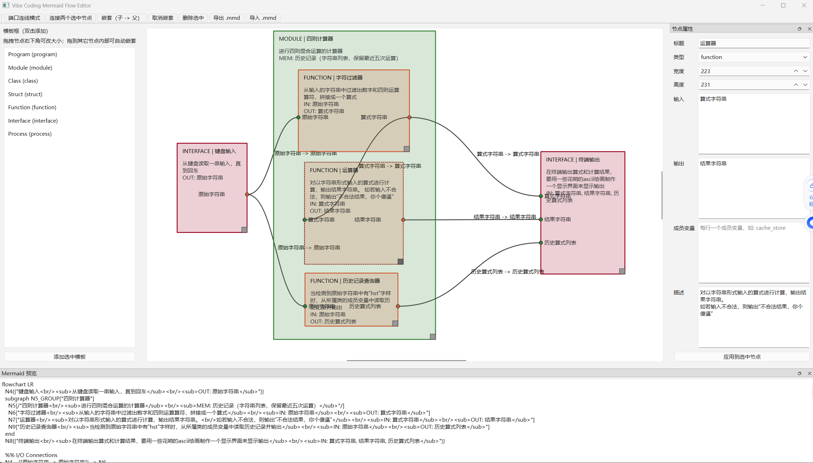

# Visual Vibe Coding

A proof-of-concept editor for describing and generating software structure with template-based Mermaid flowcharts.

English version of the main project README. The Chinese version remains the primary description in [README.md](README.md).

## Idea

The core idea is simple: in vibe coding workflows, prompt text often becomes long, fragile, and hard to maintain. A Mermaid flowchart is more structured, easier to edit, and easier for large language models to understand.

This project explores using diagrams as prompts so that code blocks, responsibilities, I/O boundaries, and state can be described more clearly.

## Why Use Flowcharts as Prompts

1. They make prompts structured and modular, which makes local edits easier and collaboration cleaner.
2. They let you describe code in blocks and layers, with explicit I/O and behavior boundaries, so AI can implement features in smaller, more reliable pieces.
3. They lower the barrier for non-experts, who can turn rough ideas into clear program flow more quickly.

## Project Status

This is a PoC, not a finished product.

Please note:

- The code contains a lot of vibe-coded material that has not been fully reviewed by hand.
- The graphics/UI are intentionally rough.
- The goal is to validate the idea of using flowcharts as prompt material, not to ship a polished production editor.

## Features

- Template-based nodes for semantic roles such as `program`, `module`, `class`, `function`, and `interface`.
- Graphical editing of nodes, resizing, and nesting.
- Explicit editing of inputs, outputs, and member variables.
- Port-based connections with output-to-input constraints.
- Import and export of Mermaid `.mmd` files.
- Embedded metadata in Mermaid text to preserve positions, sizes, parent-child relationships, and connections where possible.
- One-click export of **clean `.mmd`** without custom metadata blocks (standard Mermaid only), which is easier for LLMs to parse and usually cheaper in token usage.

## Update Highlights (This Release)

- Added "clean `.mmd` export" that removes `VC_METADATA` comment blocks.
- Better for LLM/agent prompting: less irrelevant context, better readability, and lower token cost.

## Examples

- [calculator.mmd](calculator.mmd) - A Mermaid example of a four-operations calculator.
- [test_vibe_coding.py](test_vibe_coding.py) - The corresponding Python example script. (thanks to Grok！)
- [program_flow.mmd](program_flow.mmd) - The runtime flowchart for this application itself.

## App Screenshot



## Interesting Experiment: Rebuild From Program Flow

As a practical test, I rebuilt this project once only from [program_flow.mmd](program_flow.mmd) in a separate folder, [flow_rebuild](flow_rebuild), to validate the "flowchart-first, code-second" workflow.

- Rebuild entry: [flow_rebuild/main.py](flow_rebuild/main.py)
- Rebuild core logic: [flow_rebuild/app/editor_window.py](flow_rebuild/app/editor_window.py)
- Rebuild graphics layer: [flow_rebuild/app/graphics_items.py](flow_rebuild/app/graphics_items.py)
- Rebuild flowchart: [flow_rebuild/program_flow.mmd](flow_rebuild/program_flow.mmd)

## Project Structure

- [main.py](main.py) - Application entry point.
- [app/templates.py](app/templates.py) - Template definitions.
- [app/graphics_items.py](app/graphics_items.py) - Graphics items for nodes and edges.
- [app/editor_window.py](app/editor_window.py) - Main editor window and interaction logic.

## Install and Run

### 1. Create and activate a virtual environment

Windows:

```powershell
python -m venv .venv
.venv\Scripts\activate
```

### 2. Install dependencies

```powershell
pip install -r requirements.txt
```

### 3. Start the app

```powershell
python main.py
```

## Usage

1. Create or load a Mermaid flowchart.
2. Organize program blocks with templates.
3. Fill in inputs, outputs, and member variables to make boundaries explicit.
4. Connect nodes to represent data flow and dependencies.
5. Export `.mmd` files as structured prompt material for later vibe coding work.
6. For LLM prompting, prefer the clean `.mmd` export to reduce token usage.

## Design Goal

The project is meant to solve a practical problem: complex projects are hard to describe clearly with plain text alone.

As the scope grows, natural-language prompts tend to become:

- less structured,
- harder to edit locally,
- harder to collaborate on,
- and more likely to produce tightly coupled, unclear code.

Flowcharts make those concerns explicit and help with:

- modularization,
- I/O constraints,
- hierarchy,
- and iterative local changes.

## Limitations

- This is still a prototype.
- The interaction and visual design are intentionally simple.
- It is useful for validating the idea, not for production use yet.
- Mermaid import/export still depends on the current metadata format.
- Most of this repository was written by GitHub Copilot (GPT-5.3-Codex) via vibe coding and has not been systematically reviewed by humans, so please do not expect production-grade code quality.

## License

This project is licensed under the [MIT License](LICENSE).
